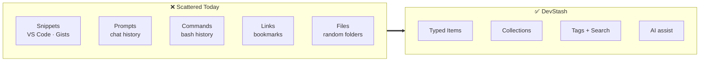
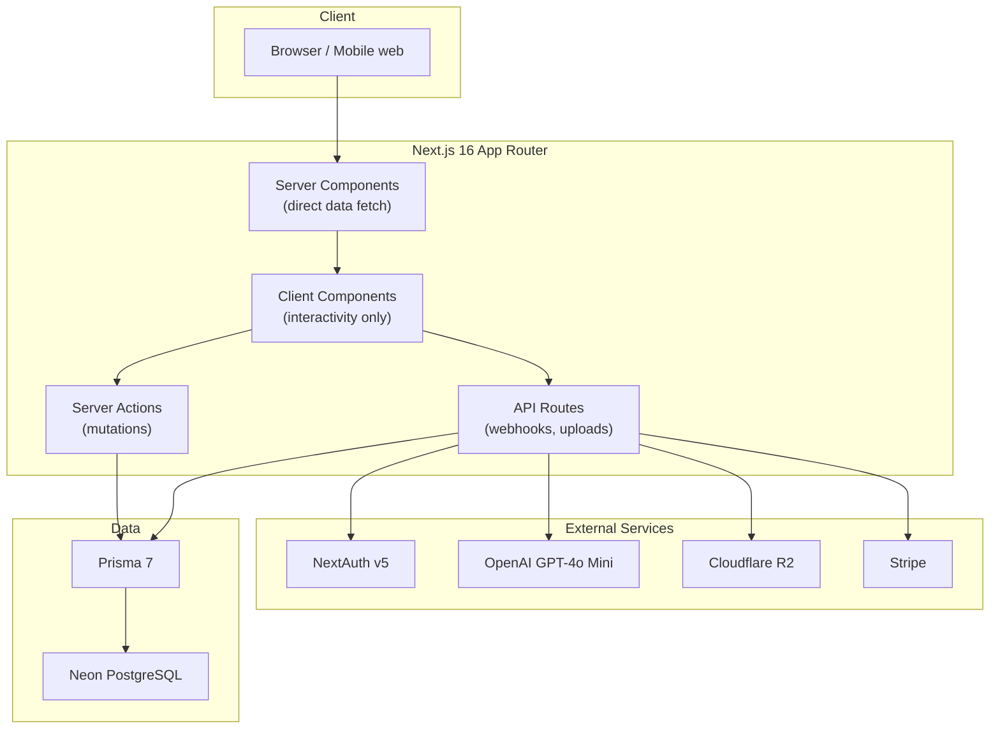
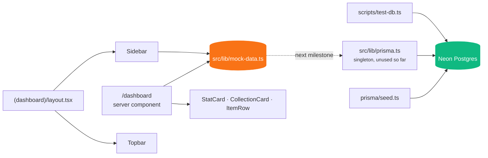
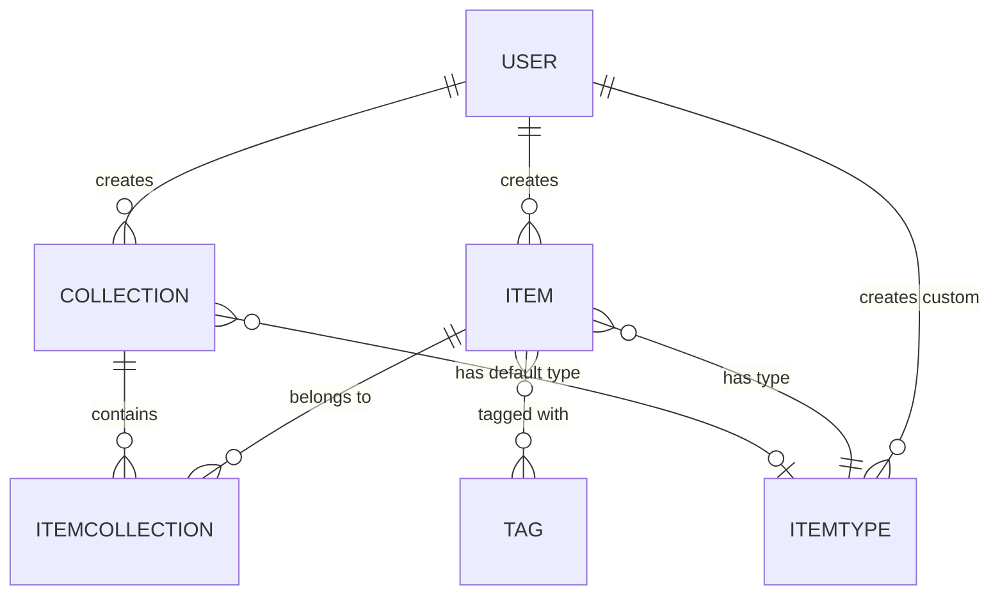
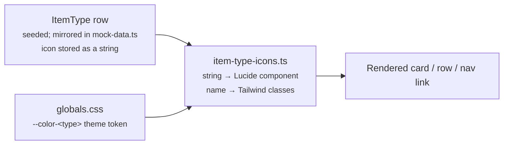
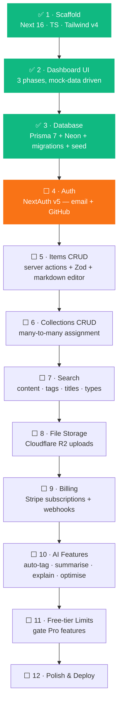
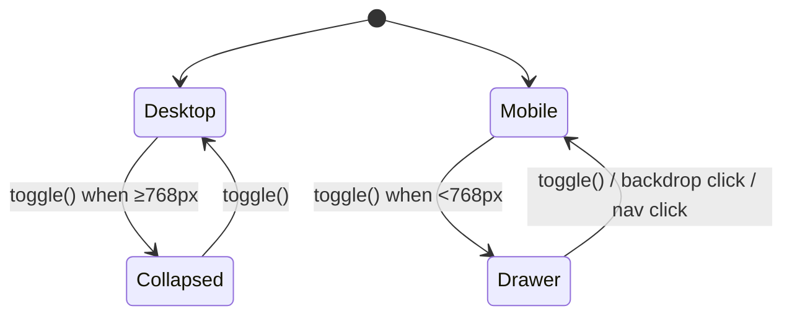
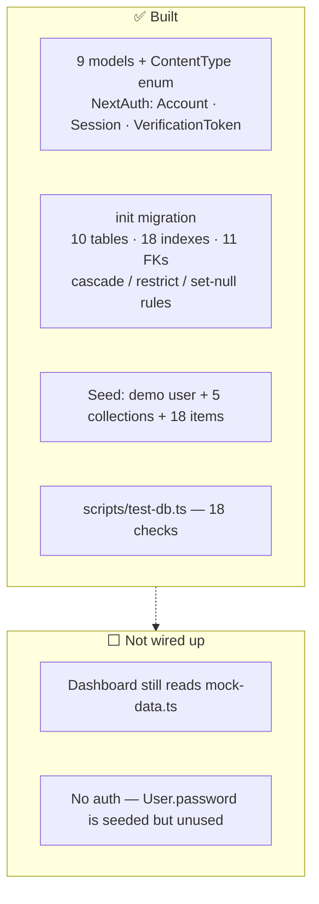
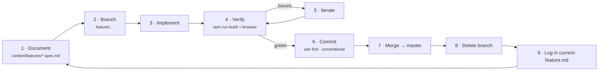

# DevStash

> One fast, searchable, AI-enhanced hub for everything a developer keeps scattered.

**Status:** 🚧 In progress — dashboard UI complete; database layer live (Prisma 7 + Neon,
migrated and seeded). The UI still renders from mock data — wiring it to real queries is next.

---

## Table of Contents

- [The Goal](#the-goal)
- [Architecture](#architecture)
- [Data Model](#data-model)
- [Item Types](#item-types)
- [Project Pipeline](#project-pipeline)
- [Progress So Far](#progress-so-far)
- [Methodology](#methodology)
- [Getting Started](#getting-started)
- [Project Structure](#project-structure)
- [Tech Stack](#tech-stack)
- [Key Conventions](#key-conventions)

---

## The Goal

Developer knowledge lives in too many places at once — snippets in VS Code, prompts buried in
chat history, commands in a `.txt` file, docs in browser bookmarks, context files lost inside
old projects. The cost is context switching and knowledge that quietly disappears.

DevStash consolidates all of it into a single typed, taggable, searchable store:



**Business model:** free tier (50 items, 3 collections, text types only) with a Pro tier at
$8/mo unlocking unlimited items, file & image uploads, AI features and export. Full spec in
[context/project-overview.md](context/project-overview.md).

---

## Architecture

### Target architecture



### What actually exists today

The database layer is **built and running**: the schema is migrated to Neon and seeded with a
demo user, 5 collections and 18 items. Auth and the API layer are still unbuilt.

The one thing to know before reading the code: **the two halves are not connected yet.** Every
page still renders from `mock-data.ts` — `src/lib/prisma.ts` is a client singleton nothing
imports so far.



`mock-data.ts` deliberately mirrors the real schema shapes (`ItemType`, `Collection`, `Item`,
`User`), and the seed was written to match what the dashboard already displays — pinned items,
favourite collections, per-type counts — so the swap stays mechanical.

---

## Data Model

Shipped in [prisma/schema.prisma](prisma/schema.prisma) and applied as the `init` migration:



Notable decisions:

- **Items ↔ Collections is many-to-many** via an `ItemCollection` join table — one snippet can
  live in "React Patterns" and "Interview Prep" at once.
- **`ItemType` is a row, not an enum.** The seven system types are seeded with
  `isSystem: true`; user-defined custom types are the same shape with a `userId`.
- **`contentType` (`TEXT` / `FILE` / `URL`)** decides which content column an item uses, and
  therefore which editor the UI shows.
- **Delete rules are deliberate.** A user cascades to their items, collections and custom
  types; `items.itemTypeId` is `RESTRICT` so a type in use cannot be deleted out from under
  its items; `collections.defaultTypeId` is `SET NULL`.
- **Tags are global, not user-owned** — they have no `userId`, so nothing cascades them. The
  seed sweeps orphans explicitly.

Full schema: [prisma/schema.prisma](prisma/schema.prisma) ·
product spec: [context/project-overview.md](context/project-overview.md).

---

## Item Types

| Type       | Icon         | Colour               | Content | Route             |
| ---------- | ------------ | -------------------- | ------- | ----------------- |
| 🔷 Snippet | `Code`       | `#3b82f6` blue       | TEXT    | `/items/snippets` |
| 🟣 Prompt  | `Sparkles`   | `#8b5cf6` purple     | TEXT    | `/items/prompts`  |
| 🟠 Command | `Terminal`   | `#f97316` orange     | TEXT    | `/items/commands` |
| 🟡 Note    | `StickyNote` | `#fde047` yellow     | TEXT    | `/items/notes`    |
| ⚫ File    | `File`       | `#6b7280` gray       | FILE    | `/items/files`    |
| 🩷 Image   | `Image`      | `#ec4899` pink       | FILE    | `/items/images`   |
| 🟢 Link    | `Link`       | `#10b981` emerald    | URL     | `/items/links`    |

All seven are seeded as `ItemType` rows with `isSystem: true` and a null `userId` — the seed
looks them up and updates in place rather than upserting, because Postgres treats that null as
distinct in the `[name, userId]` unique index, so `upsert` would insert a duplicate set on
every run.

Type presentation resolves through **three coordinated layers** — adding or renaming a type
means editing all of them:



> ⚠️ The Tailwind class maps (`ITEM_TYPE_TEXT_COLOR`, `ITEM_TYPE_BORDER_COLOR`,
> `ITEM_TYPE_SOFT_BG`) spell out full class names **literally**. Tailwind v4 scans source text,
> so an interpolated `` `text-${type.name}` `` would be purged from the build.

---

## Project Pipeline



The UI was built first, against mock data, so that layout and interaction decisions were
settled before any schema was committed to migrations.

---

## Progress So Far

| Milestone                    | Outcome                                                                                                                                            |
| ---------------------------- | -------------------------------------------------------------------------------------------------------------------------------------------------- |
| **Setup**                    | Next.js 16 + React 19 + TypeScript scaffold, boilerplate cleaned, context docs added                                                                 |
| **Mock data source**         | `src/lib/mock-data.ts` — user, 7 item types, 6 collections, 10 items, shaped to the planned schema                                                   |
| **Dashboard Phase 1** _shell_    | shadcn/ui (`base-nova`) init, `/dashboard` route group, sidebar/main shell, dark mode by default, top bar with display-only search + New Item button |
| **Dashboard Phase 2** _sidebar_  | Types nav with per-type counts and active highlighting, Collections split into Favorites / Recent, user footer, desktop collapse + mobile drawer     |
| **Dashboard Phase 3** _content_  | 4 stat cards, recent Collections grid with type-coloured accents, Pinned items, 10 most recent items; `StatCard` / `CollectionCard` / `ItemRow`      |
| **Database layer**           | Prisma 7 + Neon: 9 models incl. NextAuth, `init` migration applied, client singleton, `scripts/test-db.ts`, `db:*` scripts                           |
| **Seed data**                | Demo user (bcryptjs, 12 rounds) + 5 collections + 18 items with real URLs, tags, pins and favourites; re-runnable                                    |

**Dashboard shell behaviour** — one component tree serves both viewports:



`SidebarProvider` holds two independent states — `open` (desktop, collapses the aside to
`md:w-0`) and `openMobile` (off-canvas drawer + backdrop) — and `toggle()` routes to the right
one based on `useIsMobile()`.

**Database layer** — what shipped, and what it is not yet doing:



**Not yet built:** authentication, item/collection CRUD, real search, file uploads, billing,
AI features. Sidebar links to `/items/<type>` and `/collections/<id>` are placeholders, and no
page queries the database yet.

---

## Methodology

Every feature and fix follows the same loop:



Rules that keep this honest:

- **Specs before code.** Each feature gets a spec in `context/features/` before implementation
  starts; completed work is logged in [context/current-feature.md](context/current-feature.md).
- **Never commit without asking**, and never while the build is red.
- **Conventional commits**, one concern per commit, no AI-attribution trailers.
- **Migrations, never `db push`** — schema changes go through `prisma migrate dev` in
  development and `prisma migrate deploy` in production.
- **Stop after 2–3 failed attempts** and explain the blocker rather than trying random fixes.

Full guidelines: [context/ai-interaction.md](context/ai-interaction.md) ·
[context/coding-standards.md](context/coding-standards.md).

---

## Getting Started

```bash
npm install                 # postinstall runs `prisma generate`
cp .env.example .env        # fill in your Neon connection strings
npx prisma migrate deploy   # apply the committed migrations
npm run db:seed             # demo user + 5 collections + 18 items
npm run db:test             # confirm it all landed
npm run dev
```

Open <http://localhost:3000/dashboard>. The dashboard itself still renders from mock data, so
it will display even before the database steps — but `db:seed` and `db:test` need a real
connection.

### Environment

Both variables point at the same Neon database and both are required:

| Variable       | Endpoint                        | Used by                             |
| -------------- | ------------------------------- | ----------------------------------- |
| `DATABASE_URL` | **pooled** — `-pooler` in host  | the app and seed, at runtime         |
| `DIRECT_URL`   | **direct** — no `-pooler`       | the Prisma CLI, for migrations       |

The split matters: PgBouncer in transaction mode cannot run the DDL the schema engine emits,
so migrations need the direct endpoint.

> ⚠️ **Migrations need outbound TCP on port 5432.** The schema engine connects directly and
> cannot use the driver adapter, so `prisma migrate` fails with `P1001` on networks that block
> that port — a mobile hotspot is the quickest workaround. Ordinary app queries are unaffected,
> because `@prisma/adapter-neon` tunnels over WebSockets on 443.

### Commands

| Command             | Purpose                                                    |
| ------------------- | ---------------------------------------------------------- |
| `npm run dev`       | Dev server (Turbopack) on `:3000`                           |
| `npm run build`     | Production build — must pass before any commit              |
| `npm start`         | Serve the production build                                  |
| `npm run lint`      | ESLint flat config across the repo                          |
| `npm run db:migrate`| `prisma migrate dev` — create + apply a migration           |
| `npm run db:deploy` | `prisma migrate deploy` — apply migrations in production    |
| `npm run db:status` | Check the migration history is in sync                      |
| `npm run db:seed`   | Rebuild the demo data (safe to re-run)                      |
| `npm run db:test`   | 18 checks over schema, demo data and constraints            |
| `npm run db:studio` | Prisma Studio                                               |
| `npm run db:generate`| Regenerate the client into `src/generated/prisma`           |
| `npx next typegen`  | Regenerate `PageProps` / `LayoutProps` / `RouteContext`     |

No unit-test runner is configured yet — verification today is `npm run build`, `npm run db:test`
and a browser check.

---

## Project Structure

```
devstash/
├── context/                    # Project spec, standards, feature specs, screenshots
│   ├── project-overview.md     #   product + schema + monetization spec
│   ├── coding-standards.md     #   TS / React / Next / Tailwind conventions
│   ├── ai-interaction.md       #   the workflow above
│   ├── current-feature.md      #   in-flight work + completed history
│   └── features/               #   per-feature specs
├── prisma/
│   ├── schema.prisma           # Models — no datasource url, that lives in prisma.config.ts
│   ├── migrations/             #   generated SQL, committed and replayed in production
│   └── seed.ts                 #   demo user + 5 collections + 18 items
├── scripts/
│   └── test-db.ts              # Schema / demo data / constraint checks — `npm run db:test`
├── prisma.config.ts            # Prisma 7 config — schema path, migrations dir, seed command
└── src/
    ├── app/
    │   ├── (dashboard)/        # Route group — shell layout applies to everything inside
    │   │   ├── layout.tsx      #   SidebarProvider → Sidebar + Topbar + main
    │   │   └── dashboard/
    │   ├── globals.css         # Tailwind v4 CSS config (@theme) — no tailwind.config.*
    │   └── layout.tsx          # Root layout, dark mode hardcoded on <html>
    ├── components/
    │   ├── dashboard/          # StatCard, CollectionCard, ItemRow (server components)
    │   ├── layout/             # Sidebar, Topbar, SidebarToggle, sidebar-provider
    │   └── ui/                 # shadcn/ui primitives
    ├── generated/prisma/       # Generated Prisma client — gitignored, built by `db:generate`
    ├── hooks/                  # use-mobile
    └── lib/                    # prisma (client singleton), mock-data, item-type-icons, utils
```

---

## Tech Stack

| Layer          | Choice                            | State       |
| -------------- | --------------------------------- | ----------- |
| Framework      | Next.js 16 (App Router) / React 19 | ✅ In use   |
| Language       | TypeScript (strict)               | ✅ In use   |
| Styling        | Tailwind CSS v4 (CSS config)      | ✅ In use   |
| Components     | shadcn/ui `base-nova` + Base UI    | ✅ In use   |
| Icons          | lucide-react                      | ✅ In use   |
| ORM            | Prisma 7 (`prisma-client` generator) | ✅ In use   |
| DB driver      | `@prisma/adapter-neon` over WebSockets | ✅ In use   |
| Database       | Neon PostgreSQL (serverless)      | ✅ In use   |
| Password hash  | bcryptjs (12 rounds)              | ✅ In use   |
| Auth           | NextAuth v5 (email + GitHub)      | ⬜ Planned — models exist |
| File storage   | Cloudflare R2                     | ⬜ Planned  |
| AI             | OpenAI GPT-4o Mini                | ⬜ Planned  |
| Payments       | Stripe                            | ⬜ Planned  |

---

## Key Conventions

- **Server components by default.** `'use client'` only for interactivity, hooks, or browser
  APIs — currently just `Sidebar`, `SidebarToggle`, `sidebar-provider`, `use-mobile`.
- **Tailwind v4 is configured in CSS**, via `@theme` in `src/app/globals.css`. Do **not** create
  `tailwind.config.ts` — that is v3-era configuration.
- **shadcn/ui here is built on `@base-ui/react`, not Radix.** Generated components extend
  primitive prop types such as `ButtonPrimitive.Props`. Add components with
  `npx shadcn@latest add <component>`.
- **Dark mode is the default** and currently hardcoded via `<html className="dark">`; a toggle
  comes later.
- **Next.js 16 diverges from older App Router guides** — see [AGENTS.md](AGENTS.md) and consult
  `node_modules/next/dist/docs/` before relying on remembered APIs.
- **Path alias:** `@/*` → `./src/*`.

### Prisma 7 specifics

v7 broke several habits carried over from v6; each of these is load-bearing here:

- **The datasource URL is not in `schema.prisma`.** It lives in `prisma.config.ts`, which also
  declares the migrations directory and seed command. `.env` is **not** auto-loaded any more —
  hence `import "dotenv/config"` at the top of the config and every standalone script.
- **Import the client from `@/generated/prisma/client`, not `@prisma/client`.** The generator is
  `prisma-client` with an explicit `output`; it no longer writes into `node_modules`. The output
  is gitignored, so `postinstall` regenerates it on every install.
- **A driver adapter is mandatory** — there is no bundled query engine that opens its own
  connection. [src/lib/prisma.ts](src/lib/prisma.ts) wires `PrismaNeon`.
- **`prisma generate` is no longer implicit** after `migrate dev` (`--skip-generate` was
  removed), so run `npm run db:generate` after schema changes.
- **`$queryRaw` cannot deserialize Postgres' `name` type** — cast system columns to text, e.g.
  `select current_database()::text`.
- **Migrations, never `db push`.** `prisma migrate dev` in development, `prisma migrate deploy`
  in production; check with `npm run db:status`.
