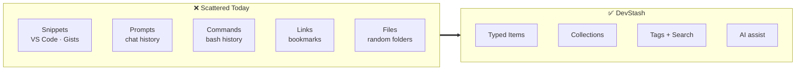
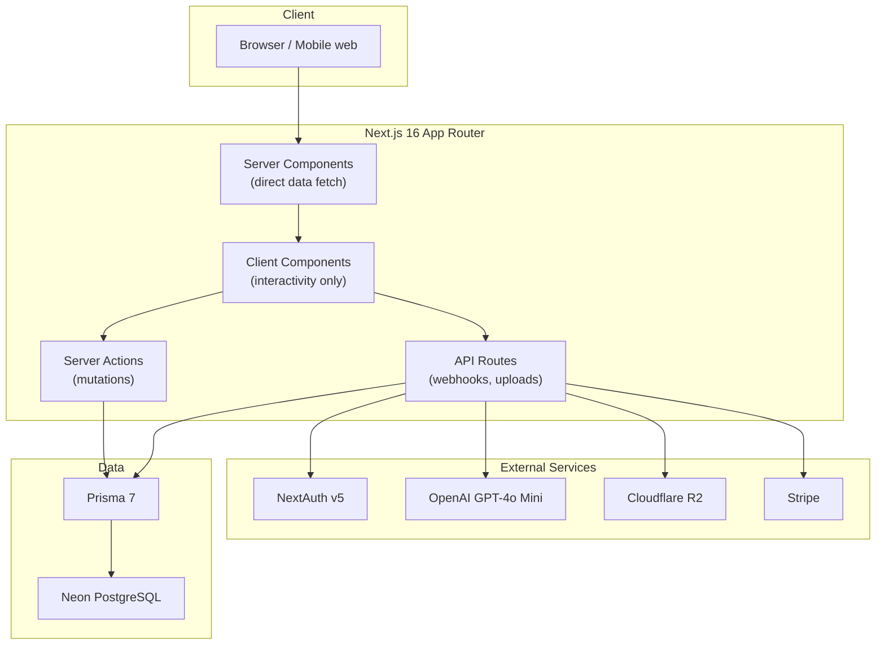
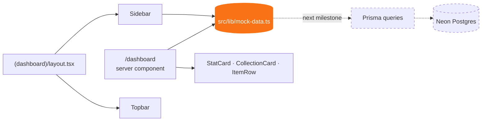
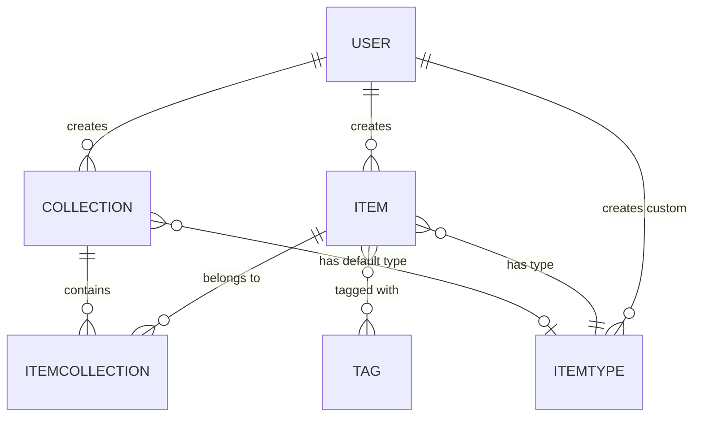
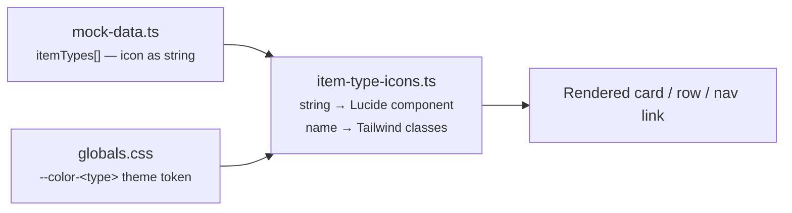
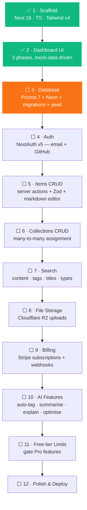
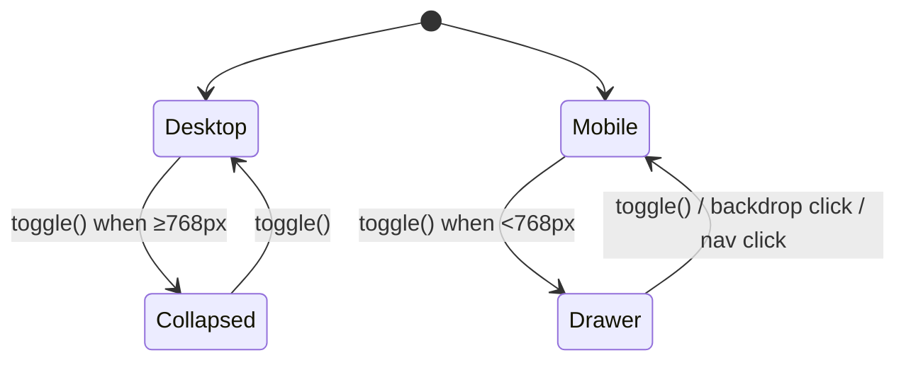
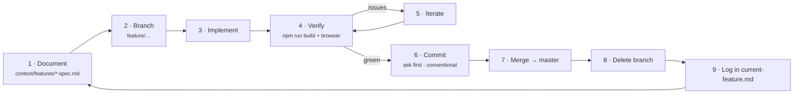

# DevStash

> One fast, searchable, AI-enhanced hub for everything a developer keeps scattered.

**Status:** 🚧 Front-end in progress — dashboard UI complete, database layer not started.

---

## Table of Contents

- [The Goal](#the-goal)
- [Architecture](#architecture)
- [Data Model](#data-model)
- [Item Types](#item-types)
- [Project Pipeline](#project-pipeline)
- [Progress So Far](#progress-so-far)
- [Methodology](#methodology)
- [Getting Started](#getting-started)
- [Project Structure](#project-structure)
- [Tech Stack](#tech-stack)
- [Key Conventions](#key-conventions)

---

## The Goal

Developer knowledge lives in too many places at once — snippets in VS Code, prompts buried in
chat history, commands in a `.txt` file, docs in browser bookmarks, context files lost inside
old projects. The cost is context switching and knowledge that quietly disappears.

DevStash consolidates all of it into a single typed, taggable, searchable store:



**Business model:** free tier (50 items, 3 collections, text types only) with a Pro tier at
$8/mo unlocking unlimited items, file & image uploads, AI features and export. Full spec in
[context/project-overview.md](context/project-overview.md).

---

## Architecture

### Target architecture



### What actually exists today

Everything on screen renders from a single mock module. No database, auth, or API layer has
been built yet — the Prisma schema in the project overview is a **target design, not shipped
code**.



`mock-data.ts` deliberately mirrors the planned schema shapes (`ItemType`, `Collection`,
`Item`, `User`), so replacing it with Prisma queries stays a mechanical swap.

---

## Data Model

Planned relational model (implemented in Prisma at the database milestone):



Notable decisions:

- **Items ↔ Collections is many-to-many** via an `ItemCollection` join table — one snippet can
  live in "React Patterns" and "Interview Prep" at once.
- **`ItemType` is a row, not an enum.** The seven system types are seeded with
  `isSystem: true`; user-defined custom types are the same shape with a `userId`.
- **`contentType` (`TEXT` / `FILE` / `URL`)** decides which content column an item uses, and
  therefore which editor the UI shows.

Full schema: [context/project-overview.md](context/project-overview.md).

---

## Item Types

| Type       | Icon         | Colour               | Content | Route             |
| ---------- | ------------ | -------------------- | ------- | ----------------- |
| 🔷 Snippet | `Code`       | `#3b82f6` blue       | TEXT    | `/items/snippets` |
| 🟣 Prompt  | `Sparkles`   | `#8b5cf6` purple     | TEXT    | `/items/prompts`  |
| 🟠 Command | `Terminal`   | `#f97316` orange     | TEXT    | `/items/commands` |
| 🟡 Note    | `StickyNote` | `#fde047` yellow     | TEXT    | `/items/notes`    |
| ⚫ File    | `File`       | `#6b7280` gray       | FILE    | `/items/files`    |
| 🩷 Image   | `Image`      | `#ec4899` pink       | FILE    | `/items/images`   |
| 🟢 Link    | `Link`       | `#10b981` emerald    | URL     | `/items/links`    |

Type presentation resolves through **three coordinated layers** — adding or renaming a type
means editing all of them:



> ⚠️ The Tailwind class maps (`ITEM_TYPE_TEXT_COLOR`, `ITEM_TYPE_BORDER_COLOR`,
> `ITEM_TYPE_SOFT_BG`) spell out full class names **literally**. Tailwind v4 scans source text,
> so an interpolated `` `text-${type.name}` `` would be purged from the build.

---

## Project Pipeline



The UI was built first, against mock data, so that layout and interaction decisions were
settled before any schema was committed to migrations.

---

## Progress So Far

| Milestone                    | Outcome                                                                                                                                            |
| ---------------------------- | -------------------------------------------------------------------------------------------------------------------------------------------------- |
| **Setup**                    | Next.js 16 + React 19 + TypeScript scaffold, boilerplate cleaned, context docs added                                                                 |
| **Mock data source**         | `src/lib/mock-data.ts` — user, 7 item types, 6 collections, 10 items, shaped to the planned schema                                                   |
| **Dashboard Phase 1** _shell_    | shadcn/ui (`base-nova`) init, `/dashboard` route group, sidebar/main shell, dark mode by default, top bar with display-only search + New Item button |
| **Dashboard Phase 2** _sidebar_  | Types nav with per-type counts and active highlighting, Collections split into Favorites / Recent, user footer, desktop collapse + mobile drawer     |
| **Dashboard Phase 3** _content_  | 4 stat cards, recent Collections grid with type-coloured accents, Pinned items, 10 most recent items; `StatCard` / `CollectionCard` / `ItemRow`      |

**Dashboard shell behaviour** — one component tree serves both viewports:



`SidebarProvider` holds two independent states — `open` (desktop, collapses the aside to
`md:w-0`) and `openMobile` (off-canvas drawer + backdrop) — and `toggle()` routes to the right
one based on `useIsMobile()`.

**Not yet built:** authentication, database, item/collection CRUD, real search, file uploads,
billing, AI features. Sidebar links to `/items/<type>` and `/collections/<id>` are placeholders.

---

## Methodology

Every feature and fix follows the same loop:



Rules that keep this honest:

- **Specs before code.** Each feature gets a spec in `context/features/` before implementation
  starts; completed work is logged in [context/current-feature.md](context/current-feature.md).
- **Never commit without asking**, and never while the build is red.
- **Conventional commits**, one concern per commit, no AI-attribution trailers.
- **Migrations, never `db push`** — schema changes go through `prisma migrate dev` in
  development and `prisma migrate deploy` in production.
- **Stop after 2–3 failed attempts** and explain the blocker rather than trying random fixes.

Full guidelines: [context/ai-interaction.md](context/ai-interaction.md) ·
[context/coding-standards.md](context/coding-standards.md).

---

## Getting Started

```bash
npm install
npm run dev
```

Open <http://localhost:3000/dashboard>. No `.env` is required yet — the app runs entirely on
mock data.

| Command            | Purpose                                                   |
| ------------------ | --------------------------------------------------------- |
| `npm run dev`      | Dev server (Turbopack) on `:3000`                          |
| `npm run build`    | Production build — must pass before any commit             |
| `npm start`        | Serve the production build                                 |
| `npm run lint`     | ESLint flat config across the repo                         |
| `npx next typegen` | Regenerate `PageProps` / `LayoutProps` / `RouteContext`    |

No test runner is configured yet — verification today is `npm run build` plus a browser check.

---

## Project Structure

```
devstash/
├── context/                    # Project spec, standards, feature specs, screenshots
│   ├── project-overview.md     #   product + schema + monetization spec
│   ├── coding-standards.md     #   TS / React / Next / Tailwind conventions
│   ├── ai-interaction.md       #   the workflow above
│   ├── current-feature.md      #   in-flight work + completed history
│   └── features/               #   per-feature specs
└── src/
    ├── app/
    │   ├── (dashboard)/        # Route group — shell layout applies to everything inside
    │   │   ├── layout.tsx      #   SidebarProvider → Sidebar + Topbar + main
    │   │   └── dashboard/
    │   ├── globals.css         # Tailwind v4 CSS config (@theme) — no tailwind.config.*
    │   └── layout.tsx          # Root layout, dark mode hardcoded on <html>
    ├── components/
    │   ├── dashboard/          # StatCard, CollectionCard, ItemRow (server components)
    │   ├── layout/             # Sidebar, Topbar, SidebarToggle, sidebar-provider
    │   └── ui/                 # shadcn/ui primitives
    ├── hooks/                  # use-mobile
    └── lib/                    # mock-data, item-type-icons, utils
```

---

## Tech Stack

| Layer          | Choice                            | State       |
| -------------- | --------------------------------- | ----------- |
| Framework      | Next.js 16 (App Router) / React 19 | ✅ In use   |
| Language       | TypeScript (strict)               | ✅ In use   |
| Styling        | Tailwind CSS v4 (CSS config)      | ✅ In use   |
| Components     | shadcn/ui `base-nova` + Base UI    | ✅ In use   |
| Icons          | lucide-react                      | ✅ In use   |
| ORM            | Prisma 7                          | ⬜ Planned  |
| Database       | Neon PostgreSQL                   | ⬜ Planned  |
| Auth           | NextAuth v5 (email + GitHub)      | ⬜ Planned  |
| File storage   | Cloudflare R2                     | ⬜ Planned  |
| AI             | OpenAI GPT-4o Mini                | ⬜ Planned  |
| Payments       | Stripe                            | ⬜ Planned  |

---

## Key Conventions

- **Server components by default.** `'use client'` only for interactivity, hooks, or browser
  APIs — currently just `Sidebar`, `SidebarToggle`, `sidebar-provider`, `use-mobile`.
- **Tailwind v4 is configured in CSS**, via `@theme` in `src/app/globals.css`. Do **not** create
  `tailwind.config.ts` — that is v3-era configuration.
- **shadcn/ui here is built on `@base-ui/react`, not Radix.** Generated components extend
  primitive prop types such as `ButtonPrimitive.Props`. Add components with
  `npx shadcn@latest add <component>`.
- **Dark mode is the default** and currently hardcoded via `<html className="dark">`; a toggle
  comes later.
- **Next.js 16 diverges from older App Router guides** — see [AGENTS.md](AGENTS.md) and consult
  `node_modules/next/dist/docs/` before relying on remembered APIs.
- **Path alias:** `@/*` → `./src/*`.
